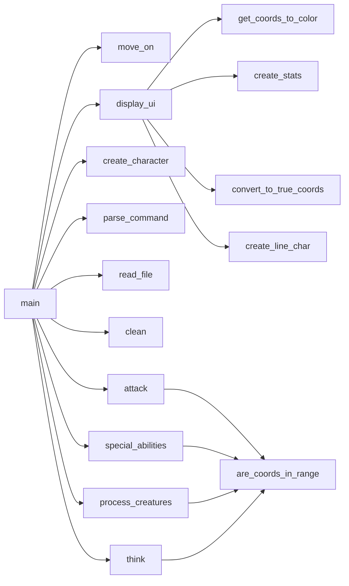

```mermaid
graph LR
main --> move_on
main --> display_ui
display_ui --> get_coords_to_color
display_ui --> create_stats
display_ui --> convert_to_true_coords
display_ui --> create_line_char
main --> create_character
main --> parse_command
main --> read_file
main --> clean
main --> attack
attack --> are_coords_in_range
main --> special_abilities
special_abilities --> are_coords_in_range
main --> process_creatures
process_creatures --> are_coords_in_range
main --> think
think --> are_coords_in_range

```